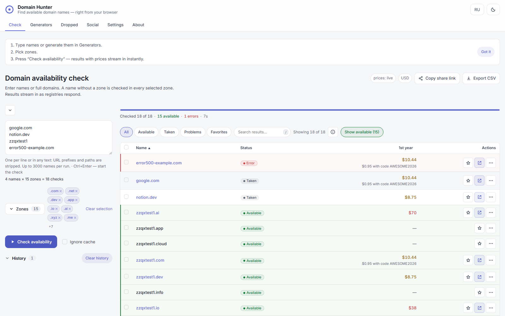
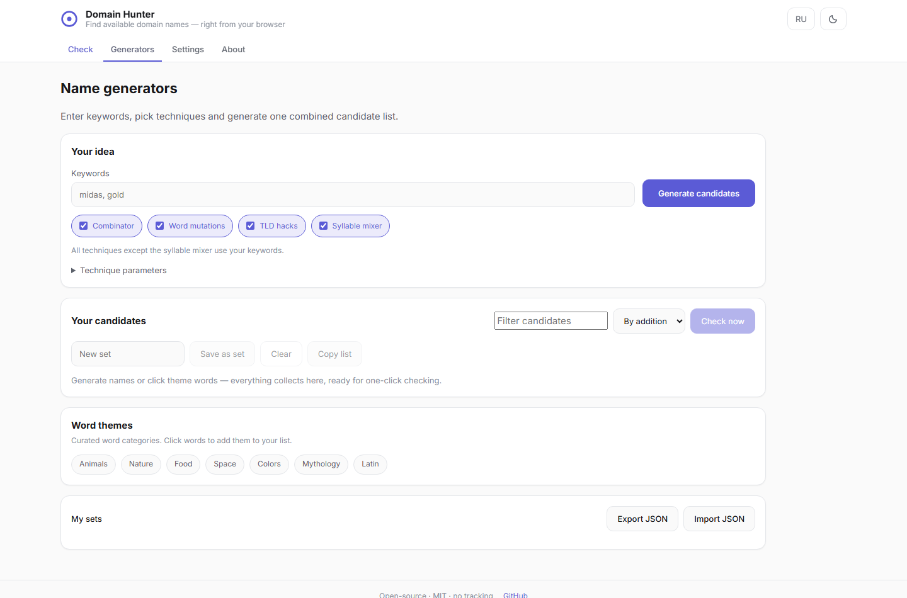

# Domain Hunter — Vérificateur de disponibilité de domaines en masse & générateur de noms

[English](README.md) | [Русский](README.ru.md) | [中文](README.zh.md) | [日本語](README.ja.md) | **Français**

[](LICENSE)
[](https://github.com/WhiteBite/Domain-Hunter/stargazers)
[](https://github.com/WhiteBite/Domain-Hunter/actions/workflows/deploy.yml)

Vérificateur de disponibilité de domaines en masse, gratuit et open-source, qui s'exécute entièrement dans votre navigateur — pas de serveurs, pas de clés API, pas de suivi.

**[▶ Démo en ligne](https://whitebite.github.io/Domain-Hunter/)** — fonctionne instantanément, rien à installer.



Domain Hunter vérifie la disponibilité des domaines directement auprès des points de terminaison **RDAP** des registres (Verisign, Google Registry, Identity Digital, CentralNic, Radix…), génère des idées de noms brandables avec cinq générateurs intégrés, affiche les **prix en direct des bureaux d'enregistrement** avec le TCO sur 3 ans, et exporte tout en CSV. C'est une alternative respectueuse de la vie privée aux services de recherche WHOIS et aux API payantes comme WhoisXML ou DomainTools — toute l'application est un seul fichier HTML autonome.

## Fonctionnalités

- **Vérification de disponibilité en masse** — collez jusqu'à 3 000 noms ; l'expansion sur les TLD sélectionnés produit jusqu'à 30 000 vérifications par exécution, diffusées en direct dans un tableau triable. Les exécutions interrompues peuvent être reprises.
- **148 zones TLD sélectionnées** — `com net io ai dev app xyz me co uk de nl fr ch so ly tech site online store cloud` et 120+ autres, réparties sur 18 infrastructures de registres. Les zones supplémentaires sont découvertes automatiquement via le bootstrap RDAP IANA en direct.
- **Résultats honnêtes à trois états** — `available` / `probably_available` / `unknown`. Pour les ccTLDs de faible confiance, un 404 est corroboré avec DNS-over-HTTPS (Cloudflare + Google DNS) avant de déclarer quoi que ce soit comme disponible. Domain Hunter ne devine jamais.
- **Cinq générateurs de noms** — combinateur racine × affixe, mélangeur de syllabes à score de prononçabilité (dérivé de CMUdict), ensembles de mots thématiques sélectionnés, astuces TLD (`family` → `fami.ly`), et mutations de mots (`midas` → `mydas`, `midaz`, `midaso`). Les candidats se collectent dans un plateau persistant qui survit aux changements d'onglet et affiche le nombre de vérifications prévues avant de les lancer.
- **Prix en direct et TCO** — prix de première année et de renouvellement en direct depuis Porkbun et Cloudflare, plus une récolte hebdomadaire comparant jusqu'à cinq bureaux d'enregistrement (instantanés Dynadot, Spaceship, ValueDomain) ; codes promotionnels, détection des pièges promotionnels (renouvellement ≥ 5× la première année), tri par TCO sur 3 ans, et liens d'achat orientés couverture vers 42 bureaux d'enregistrement. Prix en USD, RUB ou EUR.
- **« Où acheter » par domaine** — un clic sur un domaine disponible affiche un avertissement de premium du registre (avec le prix premium) et le bureau d'enregistrement actuellement le moins cher avec un lien d'achat direct (API publique DigMyName, sans clés).
- **Poli envers les registres** — limitation de débit AIMD par infrastructure (par ex. la limite stricte de ~1 rps de Google Registry est respectée), recul automatique sur HTTP 429 avec `Retry-After`, et mise en cache des résultats dans `localStorage`.
- **Favoris et historique** — étoilez n'importe quel domaine (résultats, candidats du générateur, listes d'expirés) dans une liste persistante avec son propre filtre ; les exécutions récentes sont mémorisées et restaurables en un clic. Les résultats prennent en charge la recherche, la sélection multiple et la copie de la sélection.
- **Partage et export** — liens de partage en un clic (`#s=` encode la requête + les zones, démarre automatiquement l'exécution), export CSV compatible Excel (BOM + guillemets), copie/revérification par ligne.
- **Privé par conception** — pas d'analytics, pas de télémétrie, pas de comptes. Tout l'état vit dans le `localStorage` de votre navigateur. Interface multilingue (anglais, russe, espagnol, allemand, portugais, chinois, japonais, français), thèmes clair et sombre, adapté au mobile.



## Démarrage rapide

Le build est un seul fichier HTML autonome — ouvrez-le et il fonctionne :

- **Utilisez la version hébergée :** <https://whitebite.github.io/Domain-Hunter/>
- **Exécutez localement :** ouvrez [`dist/index.html`](dist/index.html) directement depuis le disque (`file://` est entièrement pris en charge).
- **Construisez depuis les sources :**

```bash
npm install
npm run build     # produit dist/index.html — un seul fichier, tout est intégré
npm run dev       # serveur de développement Vite
```

Pas de backend, pas de variables d'environnement, pas de clés API — jamais.

## Déployez votre propre copie

**GitHub Pages** (le plus simple) :

1. Forkez ce dépôt.
2. Settings → Pages → Source : **GitHub Actions** (le workflow `deploy.yml` inclus construit et publie automatiquement à chaque push sur `main`).
3. Votre copie est en ligne à l'adresse `https://<vous>.github.io/Domain-Hunter/`.

**Cloudflare Pages :** importez le dépôt, commande de build `npm run build`, répertoire de sortie `dist`.

**N'importe quel hôte statique ou disque :** servez ou ouvrez `dist/index.html`. Tous les chemins sont relatifs (`base: './'`), donc ça fonctionne sous n'importe quel sous-chemin.

## Comment ça marche

1. Le navigateur parle **directement aux points de terminaison RDAP des registres** — tous les points de terminaison utilisés par Domain Hunter ont le CORS ouvert, donc aucun serveur ni proxy n'est requis.
2. **HTTP 200 → pris**, **404 → pas dans le registre** (ensuite les règles de confiance s'appliquent : les gTLDs de haute confiance signalent `available` ; les ccTLDs de faible confiance sont revérifiés via DNS-over-HTTPS et signalés comme `probably_available`).
3. **429 / 5xx → nouvelle tentative avec recul** ; en cas d'échecs réseau ou CORS persistants, un proxy Cloudflare Worker optionnel fourni par l'utilisateur peut prendre le relais (voir la configuration de `worker.js` dans les paramètres de l'application).
4. Les résultats sont mis en cache localement avec un TTL configurable ; la revérification se fait en un clic, et une option « ignorer le cache » force les recherches fraîches.

## Zones prises en charge

148 zones sélectionnées regroupées par infrastructure de registre : Verisign (`com net cc tv`), Google Registry (`dev app page new day how ing meme zip mov foo dad phd prof esq nexus rsvp soy boo channel`), Identity Digital (`io ai me sh ac pro info live world email studio agency` et 54 autres), CentralNic (`xyz lol icu cyou bond sbs cfd art` et 21 autres), Radix (`tech site online fun space store website press host`), Uniregistry (`cloud link top win bid loan men`), plus des points de terminaison ccTLD furtifs (`de co us uk nl fr ch ru so ly pl`) et NASK Pologne (`pl`). Le bootstrap IANA en direct ajoute automatiquement les nouveaux gTLDs délégués.

Il manque une zone ? C'est piloté par les données — ajouter une entrée dans `src/config/tlds.json` suffit, aucune modification de code n'est nécessaire.

## Domain Hunter vs alternatives

| | Domain Hunter | Champs de recherche de bureaux d'enregistrement | `whois` CLI | API payantes (WhoisXML, DomainTools) |
|---|---|---|---|---|
| Prix | Gratuit, MIT | Gratuit (vous enferme chez un bureau d'enregistrement) | Gratuit | À partir de ~19 $/mois |
| Vérification en masse | 3 000 noms × 148 TLDs | Un à la fois | Scripting requis | Oui, mesuré |
| Serveurs / clés API | **Aucun — s'exécute dans le navigateur** | N/A | Installation locale | Clé API + facturation |
| Générateurs de noms | 5 intégrés | Suggestions basiques | Aucun | Aucun |
| Prix en direct + TCO 3 ans | 12 bureaux d'enregistrement comparés | Prix propres uniquement | Aucun | Frais supplémentaire |
| Confidentialité | Pas de suivi, local uniquement | Historique de recherche journalisé | Privé | Journaux de requêtes |

Choisissez une API payante si vous avez besoin de SLAs garantis, de flux de prix pour domaines premium, ou de millions de vérifications par jour. Choisissez Domain Hunter quand vous voulez un moyen rapide, gratuit et privé de brainstormer et valider des centaines de candidats tout de suite.

## FAQ

### Comment peut-il vérifier des domaines sans serveur ni clé API ?

Les registres exposent RDAP (Registration Data Access Protocol, le successeur moderne de WHOIS) sur HTTPS, et les points de terminaison que Domain Hunter utilise envoient des en-têtes CORS permissifs. Votre navigateur les appelle directement, exactement comme il appelle n'importe quelle API publique.

### Le statut « disponible » est-il exact ?

Pour l'infrastructure gTLD sous contrat ICANN (Verisign, Google, Identity Digital, …) un 404 RDAP fait autorité. Pour les ccTLDs au RDAP moins fiable, Domain Hunter corrobore avec des recherches DNS NS et signale `probably_available` au lieu de surpromettre. Un domaine peut encore être enregistré par quelqu'un d'autre quelques secondes plus tard — une vérification est un instantané, alors achetez rapidement.

### Est-ce légal et poli envers les registres ?

Oui. RDAP est l'interface publique et lisible par machine des registres (elle existe précisément pour remplacer le WHOIS scrapé). Domain Hunter espace les requêtes par infrastructure, respecte `Retry-After`, et ralentit de façon exponentielle en cas de limitation — par ex. Google Registry reçoit au maximum ~1 requête/seconde.

### Combien de domaines puis-je vérifier à la fois ?

Jusqu'à 3 000 noms en entrée ; avec l'expansion TLD, c'est plafonné à 30 000 vérifications individuelles par exécution. Un cache local signifie que les ré-exécutions sont quasi instantanées.

### Est-ce que ça prend en charge les IDN et les ccTLDs comme .ru ou .de ?

Les noms internationalisés sont convertis en punycode automatiquement. `de co us uk nl fr ch ru so ly` sont pris en charge via des points de terminaison dédiés (`ru` est marqué expérimental en raison de restrictions géographiques sur son RDAP — le proxy de secours optionnel couvre ces cas).

### Où sont stockées mes données ?

Nulle part ailleurs que dans votre navigateur. Les paramètres, le cache et les ensembles de mots personnalisés vivent dans `localStorage` sous les clés `dh:v1:*`. Il n'y a pas de compte, pas d'état côté serveur, et aucun analytics d'aucune sorte.

## Stack technique

Svelte 5 + TypeScript (strict), Vite 7, et `vite-plugin-singlefile` — toute l'application (JS, CSS, polices, moteur de vérification Web Worker) se compile en **un seul fichier HTML** qui fonctionne aussi depuis `file://`. Les tests utilisent Vitest pour la logique pure et Playwright E2E (avec réseau simulé) pour l'UI ; le CI déploie sur GitHub Pages via GitHub Actions.

## Contribuer

Les issues et PRs sont les bienvenues. Bonnes premières contributions : nouvelles zones sélectionnées (éditez `src/config/tlds.json`), nouveaux ensembles de mots thématiques (`src/config/dictionaries/`), traductions (`src/i18n/`). Voir [AGENTS.md](AGENTS.md) pour les commandes de build/test et les conventions du projet.

## Licence

[MIT](LICENSE) — faites ce que vous voulez, attribution appréciée.

---

[](https://star-history.com/#WhiteBite/Domain-Hunter&Date)

Si Domain Hunter vous a fait gagner du temps, une ⭐ aide les autres à le trouver aussi.
